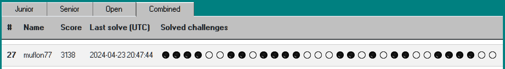

# Swiss Hacking Challenge 2024 write-ups

Here is my collection of write-ups for 2024 edition of [Swiss Hacking
Challenge](https://swiss-hacking-challenge.ch)

 

This was the first time I tried a CTF competition - something I was always
curios about, but never really got into doing it. It was great fun to revive
the memories of things I used to do decades ago &#x1F474; - and see how
they apply (or not) to the world of 2024.

I did not really intend to "compete" with the elite &#x1F602; - just wanted to
try few challenges that I liked for some reason (those marked with &#x2B50;,
mainly involving decompilation / disassembly). Then, just for the stats, I
couldn't resist to solve some of the other easy ones &#x1F60A;

 

## Practice is the king

Overall, it was clear that I lacked experience here. Looking at
[Coderion's writeups](http://blog.gk.wtf/posts/shc-2024) I realized
just *how* overengineered some of my solutions were &#x1F926;&#x1F926;&#x1F926;.
Two main examples:

**a-smap-in-the-face**:

*   [My solution](a-smap-in-the-face.md): full rev-eng of randomized offsets
    in kernel structs, correlating kernel disassembly with source code,
    overwrite these structs in the TCB, write a micro exploit in assembly for
    all that, with a hand-tuned ELF header...
*   [Better solution](https://blog.gk.wtf/shc24/a-smap-in-the-face/): Just
    exploit `modprobe_path`, use `musl-gcc` to produce small executable.

**train-dilemma-to-work**:

*   [My solution](train-dilemma-to-work.md): analyze and disable debugger detection,
    decrypt all the encrypted code (persistently, by patching the binary!), insert
    hand-crafted assembly payloads in multiple places to extract the flag at runtime...
*   [Better solution](https://blog.gk.wtf/shc24/train-dilemma-to-work/): Just grab
    a (decrypted, unlocked) core while the program is running, analyze from
    there, rewrite key routines in Python.

But also in many other challenges, I see that what I thought is a complex problem that
needs to be "solved" from first principles, in reality has a
_"there is a (tool|web page|library) for this"_ answer.

 

Lots of fun nevertheless. Thanks to the organizers for providing it!

 

# Write-ups

## Crypto

*   [office-encryption](office-encryption.md)
*   [farm-life](farm-life.md)

## Forensics

*   [printer-destroyer-format](printer-destroyer-format.md)
*   [what-is-a-pin](what-is-a-pin.md) &#x2B50;
*   [optimized-ntfs](optimized-ntfs.md)

## Misc

*   [least-suspicious-bit](least-suspicious-bit.md)
*   [rogue-clippy](rogue-clippy.md)
*   [cheated-results](cheated-results.md)

## Pwn

*   [office-program](office-program.md)
*   [time-clock](time-clock.md) &#x2B50;
*   [a-smap-in-the-face](a-smap-in-the-face.md) &#x2B50;

## Re

*   [printer-manual](printer-manual.md)
*   [winning-argument](winning-argument.md) &#x2B50;
*   [license-check](license-check.md) &#x2B50;
*   [train-dilemma-to-work](train-dilemma-to-work.md) &#x2B50;

## Web

*   [serverless-login](serverless-login.md)
*   [office-press](office-press.md)
*   [sentry-as-navigation](sentry-as-navigation.md) &#x2B50;

