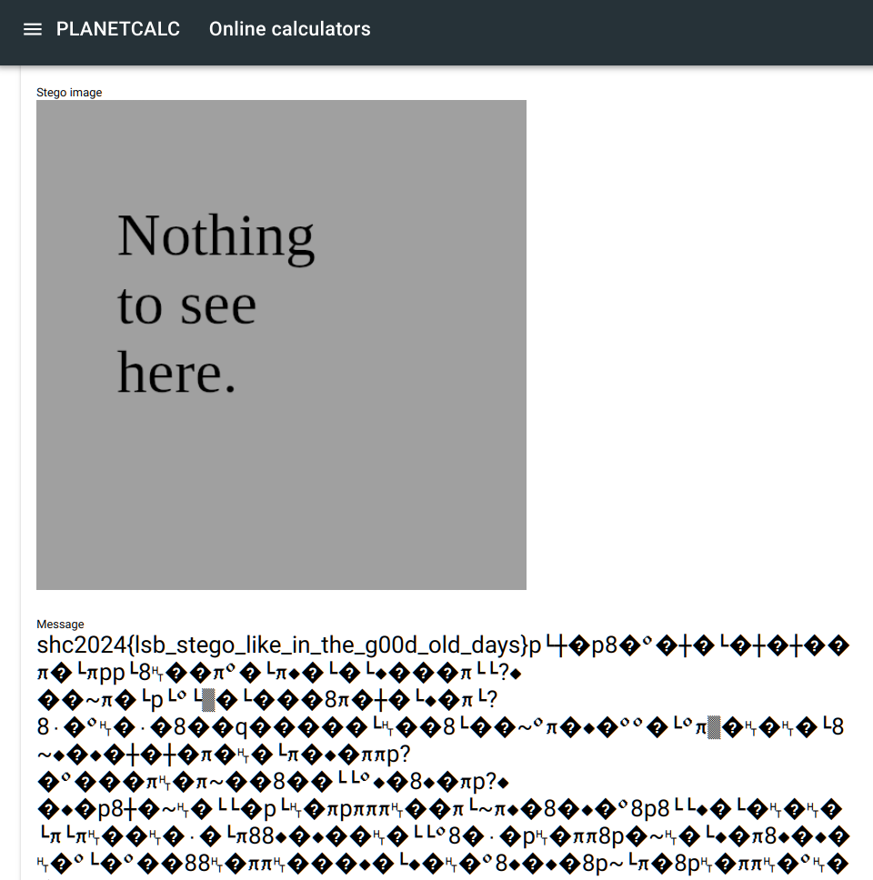

# [least-suspicious-bit](http://ctf.m0unt41n.ch/challenges/least-suspicious-bit) (`misc`, `baby`)

# TL;DR

We're given a PNG image and the name of the challenge pretty much says everything &#x1F60A;

Google search: `image least significant bit steganography` gets us
[https://planetcalc.com/9345](https://planetcalc.com/9345) and uploading the
image there gets us:



# The flag

```
shc2024{lsb_stego_like_in_the_g00d_old_days}
```
